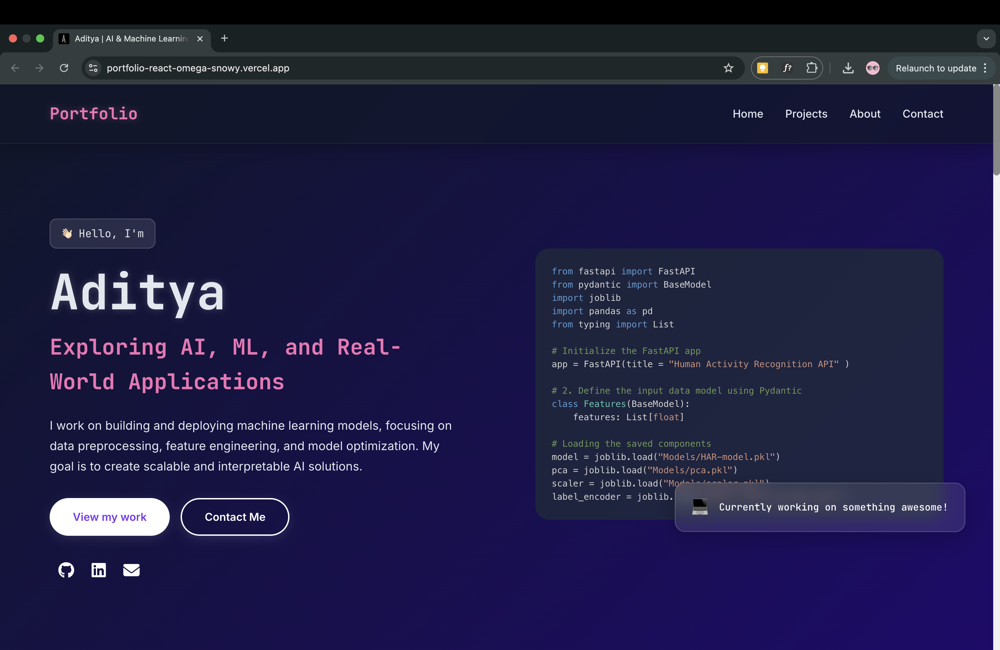

# Aditya's Personal Portfolio

A personal portfolio website built with React and Vite to showcase my projects, skills, and experience in AI & Machine Learning.

**Live Demo:** [https://portfolio-react-omega-snowy.vercel.app/](https://portfolio-react-omega-snowy.vercel.app/)



---

## ✨ Key Features
- **Modern UI/UX:** Built with React and animated with Framer Motion for a smooth, responsive experience.
- **Project Showcase:** A grid displaying my top ML projects with links to their codebases.
- **Interactive Timeline:** A summary of my internship and educational background.
- **Functional Contact Form:** Allows visitors to send messages directly using EmailJS.

---

## 🛠️ Built With
- React
- Vite
- Framer Motion
- EmailJS
- React Syntax Highlighter
- Hamburger React

---

## 🚀 Getting Started

To run this project locally:

1.  **Clone the repository**
    ```sh
    git clone [https://github.com/solar-node/Portfolio-react.git](https://github.com/solar-node/Portfolio-react.git)
    ```

2.  **Install dependencies**
    ```sh
    cd Portfolio-react
    npm install
    ```

3.  **Set up environment variables**
    Create a `.env` file in the root directory and add your EmailJS credentials:
    ```
    VITE_EMAILJS_SERVICE_ID='YOUR_SERVICE_ID'
    VITE_EMAILJS_TEMPLATE_ID='YOUR_TEMPLATE_ID'
    VITE_EMAILJS_PUBLIC_KEY='YOUR_PUBLIC_KEY'
    ```

4.  **Run the app**
    ```sh
    npm run dev
    ```

---

### 📂 Project Structure
```plaintext
Portfolio-react/
├── .gitignore          
├── README.md         
├── eslint.config.js    
├── index.html          # The main HTML entry point for the app
├── public/             # Contains static assets that don't need processing
│   └── Assets/
│       ├── favicon.ico
│       └── vite.svg
└── src/                # Contains all the source code for the application
    ├── assets/         # Contains assets like images that are used in components
    │   └── react.svg
    ├── components/     # Contains reusable React components
    │   ├── About.jsx
    │   ├── Contact.jsx
    │   ├── Experience.jsx
    │   ├── Hero.jsx
    │   ├── Navbar.jsx
    │   └── Projects.jsx
    ├── App.css         # Main stylesheet for the App component
    ├── App.jsx         # The root React component
    ├── index.css       # Global styles for the entire application
    └── main.jsx        # The entry point that renders the React app
